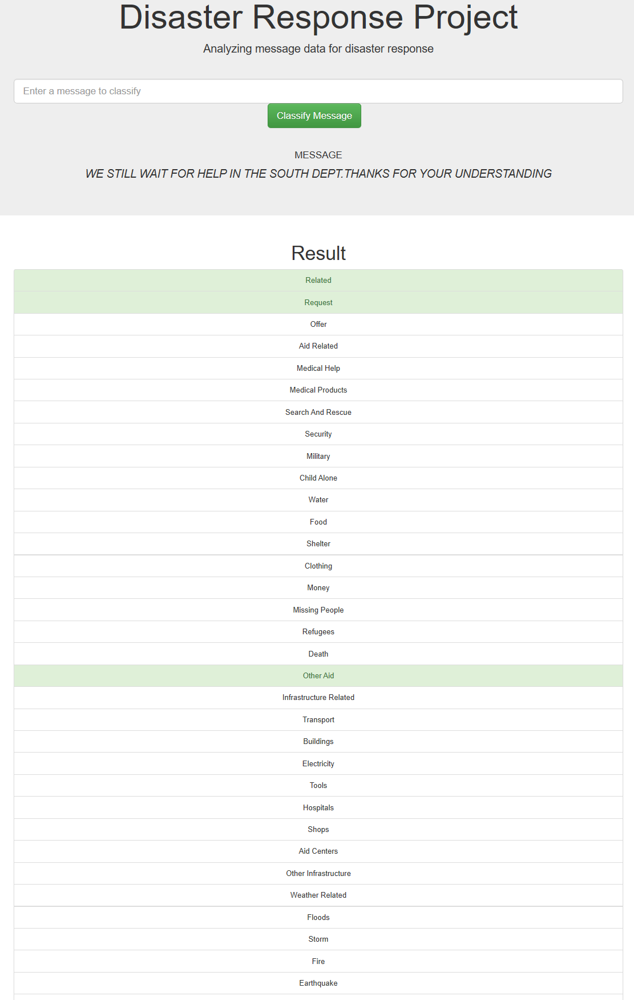

# Disaster Response Machine Learning Pipeline

### What is this? 

This is a simple web app to read disaster response messages and judge what kind of messages they are.

### How the algorithm is? 

- Using Logistic Regression to judge whether each message is categorized to each of 36 categories 
- There are 36 models working parallel, and a message can be categorized in multiple categories
- As for the preprocessing, Tf-idf is applied

### Instructions for running:
1. Run the following commands in `deploy` directory to set up the database and model.

    - To run ETL pipeline that cleans data and stores in database
        `python data/process_data.py data/disaster_messages.csv data/disaster_categories.csv sqlite:///data/database.db`
    - To run ML pipeline that trains classifier and saves
        `python models/train_classifier.py sqlite:///data/database.db models/finalized_model.pkl`

2. Run the following command in `deploy/app` directory to run the web app.
    `python run.py`

3. Go to http://localhost:3001/  

4. Input a sentence on the input box and click the button below, then the analysis results will appear. 